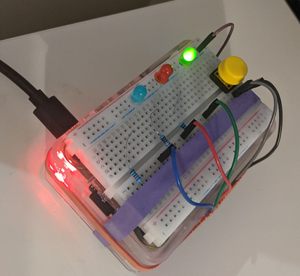

# pi-productivity

## What does this do?
I find that I stick to what I need to do better when there's a reminder in my space of something I need to be doing or paying attention to. A physical nudge. This is a simple project that enables my Raspberry Pi to reflect the state of my Inbox, Calendar, and to-do list using 4 LEDs. 

If the green light is on, everything is great. If any other light is good, I should be paying attention to __something__.

The nudges I implemented only make sense in the organizational approach I use. I describe it a bit below. You're welcome to try it or tweak it.

## Hardware
Out of the box, this code should run on any Raspberry Pi with Python 3, 4 LEDs and an optional switch button wired up to configurable GPIO pins. If you're doing this, I assume you already know how to connect basic electronics (eg using resistors so your LEDs don't blow up.) However, relatively little code here is Raspberry-Pi specific - for example all the code that connects to APIs and applies logic to determine if some area of my productivity system needs attention can run on anything. 

In my personal implementation, I soldered the electronics onto a shield board that attached directly over the Pi. However, that's purely an aesthetic choice (and an excuse to buy these boards and solder.) Previously, a solderless breadboard rubber-banded to the PI worked just as well. 3-led earlier version shown:

### Personal Setup
The things that I want to personally be aware of:
- **If there's an email in my gmail inbox older than a day**. I practice inbox-zero so ideally there should not be anything stale in the box. If there is, a light comes on (yellow) to remind me I need to go clean things out. Note that this is not a "you got mail" light - I don't want to be distracted when a message comes in. That's why the light does not come on until the message is a day old, as that means I likely had seen the email and been avoiding deadling with/deleting it.
- **If I had made any progress on my todo list in the last 3 hours**. I break down my tasks projects into small chunks so incremental progress can always be made and going 3 hours without anything getting checked off can be a sign I am not focusing on my projects. In practice, I don't pay attention to this during work hours as I manage my work-tasks differently, but I pay attention to this on the weekends and in the evenints. There's a green light if I had crossed something off or added something to my list in the last 3 hours and otherwise a red light.
- **Whether I have any Calendar events coming up in the next 24 hours**. At work I look at my calendar constantly but my personal calendar is pretty sparse and I don't look at it ofter. So I have a reminder (blue light) that lights up if I have anything coming up in the next 24 hours. The light barely blinks if the apointment is a long time from now and gets a little more intense as the time approaches. The idea is that it forces me to check my calendar to see what it is that I have coming up. 
